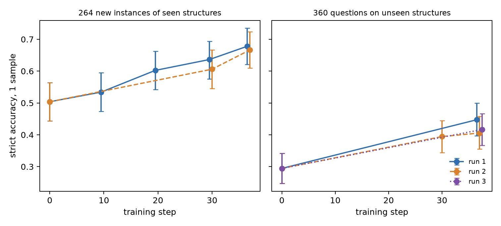
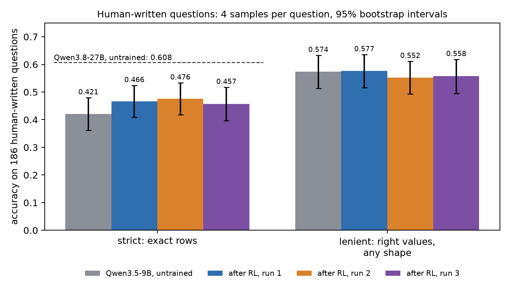
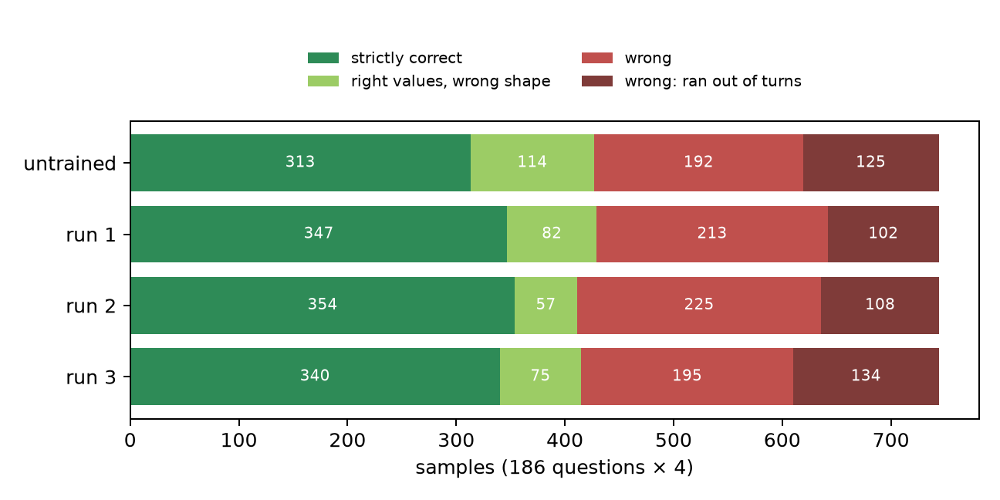
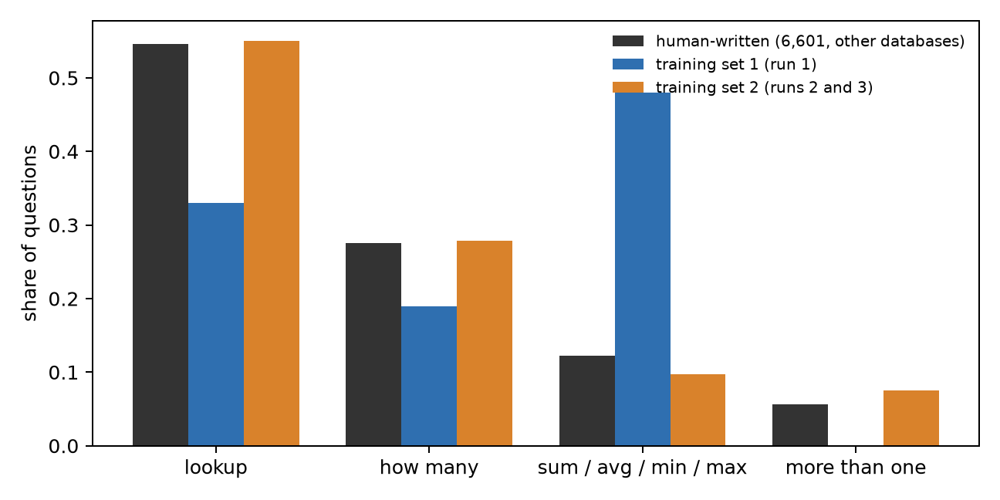
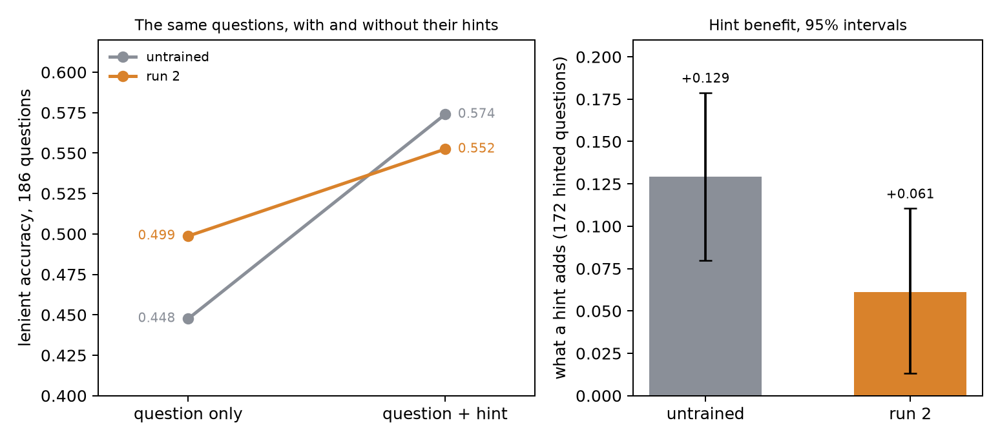
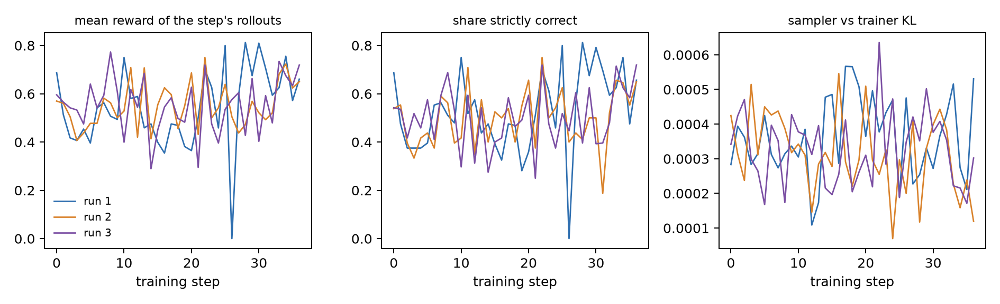

# We trained a small model to query a graph with RL. It got better, and it stopped listening.

*Final draft, 6 October 2026. Sources for every number are in the table at the end.*

Most reinforcement-learning write-ups end with a curve going up and to the right. Ours has one
of those. But the more useful things we learned came from the place where the curve did not go
up, from two predictions we wrote down in advance and watched fail, and from one that held and
told us something we had not expected: the trained model had learned to pay less attention to
part of its own prompt.

## The problem

Suppose you have a graph database and you want people to be able to ask it questions in plain
English. The standard answer is an agent: a language model that can write a query, run it, look
at what came back, and try again until it has an answer. Large models do this reasonably well.
Small models, the kind you can afford to run at volume, do it noticeably worse.

We wanted to know how much of that difference can be trained away. Not by collecting thousands
of hand-written examples, which nobody has for their own database, but by letting the model
practise against the database itself and rewarding it when its final query returns the right
rows.

## The setup

Our graph is one of the databases from the BIRD text-to-SQL benchmark, a dump of a statistics
Q&A site, remodelled as a property graph in Neo4j: about 650,000 nodes and 1.38 million
relationships, covering users, questions, answers, comments, votes, tags, badges and edit
history.

The agent is Qwen3.5-9B with a single tool that runs a read-only Cypher query. It gets a
question, usually with a short hint, and has up to eight turns. Whatever its last successful
query returns is its answer.

We score answers two ways, and the distinction turns out to matter a great deal. *Strict*
accuracy asks whether the rows the agent returned are exactly the reference rows. *Lenient*
accuracy only asks whether the right values are in there, forgiving an extra column or a
different column order. An agent that answers "how many posts did this user write?" with the
user's id and the number 121 is leniently right and strictly wrong.

For training we used no human questions at all. We generated queries first, by enumerating
query shapes over the schema, filling in real values and executing them, and then had a model
write a natural question for each one. Some query shapes were held out completely, so that we
could later ask whether the agent had learned to query the graph or merely memorised patterns.

The reward is as plain as we could make it. Run the agent's final query, compare its rows with
the reference rows, and score the overlap:

$$ r = \frac{2PR}{P + R} $$

where $P$ is the fraction of the agent's rows that are correct and $R$ the fraction of the
reference rows it found. The reward is 1 exactly when the answer is strictly right. There is no
judge model anywhere in the loop.

Each training step takes 8 questions and lets the model attempt each one 8 times. An attempt's
advantage $A$ is its reward minus the average reward of the 8 attempts at the same question, so
the model is pushed towards whatever it did on its better tries. The update is the
importance-sampling policy gradient that the Tinker API provides,

$$ \mathcal{L}_{IS}(\theta) = \mathbb{E}_{x \sim q}\left[\frac{p_\theta(x)}{q(x)}\,A(x)\right], $$

applied to a rank-32 LoRA adapter. A run is 37 such steps: about 2,400 attempts, under an hour,
and roughly $35 to $37 including all the evaluation afterwards.

The test that matters is the benchmark's own 186 human-written questions for this database,
which the model never sees in training. Because the model samples its answers, a single pass
over 186 questions is noisy, so we run every question four times and compare models question by
question. Before training anything we fixed what would count as a result: an improvement in
strict accuracy of at least five points whose 95% interval excludes zero.

## What went up

On generated questions the model had not seen, training worked, and by a wide margin.

On new questions built from query shapes it had practised, strict accuracy went from 0.50 to
0.68 and 0.67 in the two runs where we measured it. On query shapes it had never encountered in training, it went from 0.29 to between 0.41
and 0.45 across three runs. That second number is the one we care about: the model was not
shown these patterns and still got nearly half again as many right.

It helps to see what that looks like. Here is a four-hop question from the unseen set:

> What mean score do the distinct posts commented on by authors of posts linked to from posts
> titled 'Local median and local average' have?

The untrained model spends all eight turns on it. It follows the link relationship in the wrong
direction, writes three queries that do not parse, and runs out of turns without an answer. The
trained model writes one query, gets 4.0, and stops. We picked this example by a rule, not by
taste: among the questions on unseen structures that the untrained model got wrong by any
standard and two trained models got exactly right, of which there are forty, it is one of the
deepest.

On the human-written questions the picture is more modest but real.

Strict accuracy rose from 0.421 to 0.466, 0.476 and 0.457 in three runs. Against our bar, the
first run came in at +4.6 points and missed by less than half a point, the second at +5.5 and
cleared it, the third at +3.6 with an interval that just touches zero. The three runs trained on
three different sets of questions, and no two of them can be told apart statistically. The fair
summary is that RL bought four to five points on human questions, and that is between a fifth and
a third of the distance to a model three times the size.

## What did not go up

Now look at the right-hand group of bars. Lenient accuracy on human questions did not rise in
any run: 0.574 before training, then 0.577, 0.552 and 0.558. The model is not finding more
right answers to human questions. It is returning the answers it already had in the form that
was asked for.

Sorting every one of the 744 attempts by how it ended makes this visible.

Between the untrained model and the first run, the light-green band, right values in the wrong
shape, shrinks by 32 attempts and the dark-green band grows by 34. That is nearly the whole
gain. One question shows it in miniature:

> For the post which got 1910 view counts, how many comments does it get?

The reference answer is the single number 1. The untrained model found that number on all four
tries, and on three of them returned it with extras: the post's id beside it twice, and once
the id, the title and the score as well. After training, all four tries in both of the first
two runs returned the count and nothing else. (The rule for choosing it: among questions the
model always got leniently right before and after, the one with the largest strict gain.)

That is a genuine improvement, and for anyone whose downstream code expects a particular shape
it is the improvement that matters. But on generated questions the model had also learned to
find more right answers, by nine to twelve points of lenient accuracy. Why did that part stay
behind?

## First guess: the wrong kind of question

We measured what people ask. Across 6,601 human-written questions from 69 other databases in
the same benchmark, more than half are plain lookups and another quarter are "how many". Sums,
averages, minima and maxima are about 12%. In our training set they were nearly half.

It was a tidy story, and tidy stories are dangerous, so before building anything we wrote the
prediction into the experiment journal: a training set whose mix follows the human one will
raise lenient accuracy on human questions above the first run. We built that set, had a second
agent verify independently that none of it leaked into any held-out set, and trained again.

The prediction failed. Lenient accuracy in the second run was 2.4 points *below* the first,
with an interval that just includes zero. Matching the kinds of questions people ask did not
make the model better at answering people.

## Second guess: the hints

While that run was training, the agent checking our data noticed something else. In the
benchmark, a hint explains a phrase from the question. One of the 186 asks, "Among the posts
owned by an elder user, how many of them have a score of over 19?", and its hint reads "elder
users refers to Age > 65; Score of over 19 refers to Score >= 20". Our generated hints were
different. Here is one:

> **Question:** What are the titles (or the first 120 body characters for untitled posts) of
> the posts authored by users with reputation exactly 180?
> **Hint:** score refers to Score; post text refers to Title when present, otherwise the first
> 120 characters of Body; each qualifying entity is counted once.

The question never mentions a score. The generator had described what its own query touched,
not what the question asked. Measured across the training set, 82% of our hints explain a term
that appears nowhere in the question; among human-written hints the figure is 2.2%. A model
that is rewarded for exact answers while being handed hints about fields it must not return
has every reason to learn to stop reading hints. And on human questions, the hint is often the
only thing that says which field a loose phrase means.

This time we could test the idea directly before training anything. We took the 186 human
questions, removed their hints, and asked both the untrained model and the trained one again.

For the untrained model, a hint is worth 12.9 points of lenient accuracy on the questions that
have one. For the trained model it is worth 6.1. The difference, 6.8 points, has an interval
that excludes zero, and it is what we had predicted in writing. A second agent recomputed it
from the raw outputs with its own code and got the same numbers.

The left panel is the clearest picture in this post. Without hints, the trained model is the
better of the two: it has learned to answer from the question alone. With hints, it is no
better than where it started. Everything it gained in skill it gave back in attention.

Two cautions belong here. The effect is clear on lenient accuracy and not on strict, where the
trained model keeps most of the benefit and the difference is not distinguishable from zero.
And a smaller benefit could mean the model discounts hints or that it has learned skills that
stand in for them; the second alone would not explain losing ground when hints are present,
but we have not separated the two.

## And the fix that did not fix it

The obvious next step was to repair the hints and train again. We rewrote all 291 so that every
explained phrase is taken from its question, changed nothing else, not the questions, not their
order, not a setting, and wrote down the prediction: lenient accuracy on human questions will
be higher than in the second run.

It was not. The third run scored 0.558 against 0.552, a difference of half a point with an
interval centred on zero.

So we are left with a finding and without its cause. Training on our data roughly halves what a
hint is worth to this model; that much is measured twice. Making the training hints agree with
their questions in form does not undo it, at least not in one run. We know one reason our
repair may have been too weak, because the agent that reviewed it said so before the run: in
fixing the mismatch, the rewrite also made the hints emptier and more formulaic. Thirty-six
distinct templates cover all 694 clauses. Human hints are not like that. A model has little to
gain from reading a hint that tells it almost nothing, whether or not its words come from the
question.

## What we would tell someone starting this

Reward from execution works, and it is cheap. No judge, no demonstrations, an hour and a few
tens of dollars, and a small model gets measurably better at using a tool against a real
database, including on query shapes it has not seen.

Score your results in more than one way. With strict accuracy alone we would have a clean
five-point win and a wrong idea of what the model learned.

Test what your model attends to, not only what it scores. Removing one part of the prompt and
measuring the drop cost us less than five dollars and told us more than a training run did.

Write the prediction down before the run. Two of ours were wrong and one was right, and we know
which is which only because they were written down first.

And treat everything in a synthetic prompt as training signal. We checked the questions with
care and gave the hints a glance. The model, it turns out, read both.

## A note on how this was done

The work was carried out by three AI agents with a human directing: one ran training and
evaluation, one independently recomputed every headline number from the raw outputs with its own
code, and one generated data against a written specification. They shared a single append-only
ledger of facts. Several statements in this post differ from their first drafts because the
checking agent would not accept them, and the hint problem was that agent's discovery. The same
recipe applied to a larger model on a different platform is written up separately.

*In-run curves, for completeness. Every step sees different questions, so the reward curve is
not a learning curve; the evidence of learning is the held-out accuracy above. The loss for this
objective is not informative either: recorded for the third run, it swings between about −4,500
and +6,200 with no trend.*

---

### Sources for the numbers

Figures are drawn by `make_figures.py` from the run folders; the plotted values are in
`figures/numbers.json`. Intervals are 95% paired bootstrap intervals over questions (10,000
resamples). Ledger rows refer to `SHARED_LEDGER.md` in the repository.

| claim | value | ledger |
|---|---|---|
| graph size | 649,846 nodes, 1,380,394 relationships | counted live 2026-10-03 |
| human questions, strict: untrained / run 1 / run 2 / run 3 | 0.4207 / 0.4664 / 0.4758 / 0.4570 | T8, T14 |
| human questions, lenient | 0.5739 / 0.5766 / 0.5524 / 0.5578 | T8, T14 |
| run 1 − untrained, strict | +0.0457 [+0.0094, +0.0833] | T8, T10 |
| run 2 − untrained, strict | +0.0551 [+0.0202, +0.0914] | T8 |
| run 3 − untrained, strict | +0.0363 [−0.0013, +0.0739] | T14 |
| run 2 − run 1, lenient | −0.0242 [−0.0538, +0.0040] | T8 |
| run 3 − run 2, lenient | +0.0054 [−0.0242, +0.0363] | T14 |
| outcome counts per 744 attempts | 313/114/192/125; 347/82/213/102; 354/57/224/108 (+1 no query); 340/75/194/134 (+1) | T12, T14 |
| seen structures (264), strict: untrained / run 1 / run 2 | 0.5038 / 0.6780 / 0.6667 | T9 |
| unseen structures (360), strict: untrained / run 1 / run 2 / run 3 | 0.2944 / 0.4472 / 0.4056 / 0.4167 | T9, T14 |
| lenient gain on generated sets | +0.09 to +0.12 | T9, W5 |
| Qwen3.8-27B untrained, strict | 0.608, one sample | run folder `e2_full_qwen3_8_27b` |
| question mix | see figure | `numbers.json`, W9 |
| hints explaining an absent term | 82.1% ours, 2.2% human; 0% after the rewrite | W11, T14 |
| hint benefit, lenient: untrained / run 2 | +0.1294 [+0.0799, +0.1788] / +0.0610 [+0.0131, +0.1105] | T13 |
| difference of hint benefits | −0.0683 [−0.1090, −0.0291]; strict −0.0291 [−0.0727, +0.0160] | T13 |
| lenient without / with hint: untrained, run 2 | 0.4476 / 0.5739; 0.4987 / 0.5524 | T13 |
| templates in rewritten hints | 36 over 694 clauses | journal, E10 data |
| training objective | importance sampling, as documented | T16 |
| cost of one run with evaluations | $34.96 to $37.25 billed | T11, T15 |
| cost of the hint-removal check | $4.72 billed | T15 |

### Limits
- One training run per condition. The three runs differ in their training data, and none of the
  pairwise differences between them is statistically distinguishable; how much two runs on the
  *same* data would differ was never measured.
- The with-hint and without-hint passes were sampled on different days. The comparison between
  the two models cancels any drift common to both; neither model's hint benefit alone should be
  quoted without that caveat.
- The rewritten hints fix one measured property and are less informative than the originals, so
  the third run is not a test of training on hints as good as human ones.
- Whether the third run's model itself relies on hints more than the second's was not measured.
- The 27B reference figure is a single pass.
