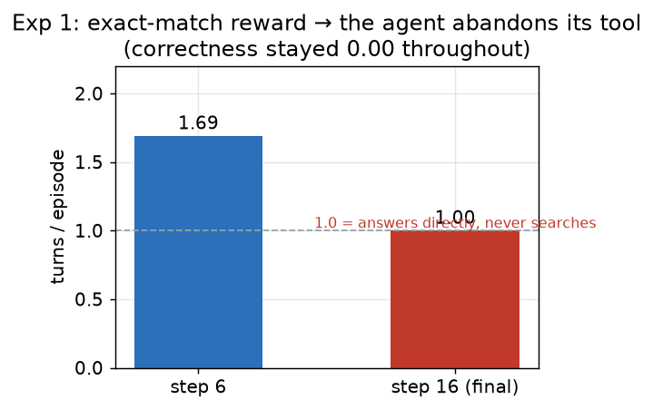
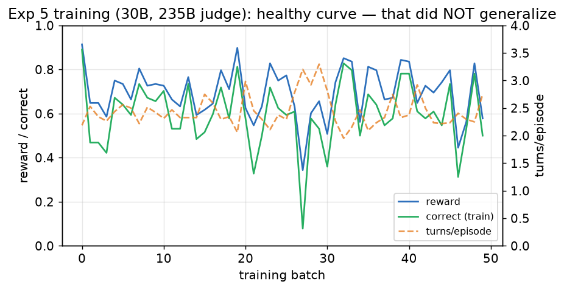
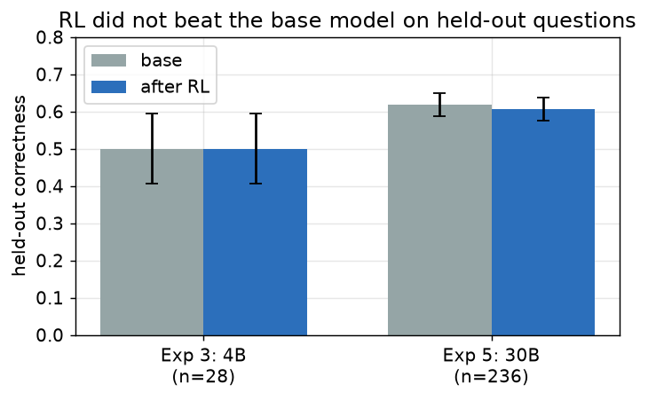
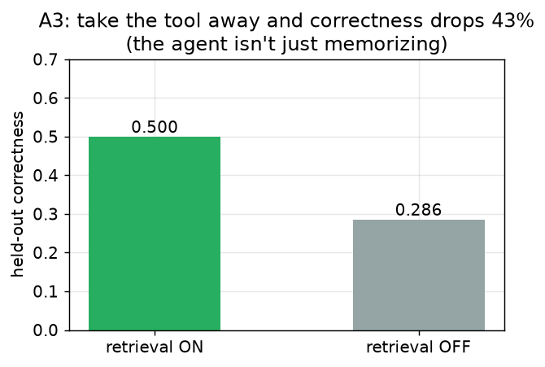
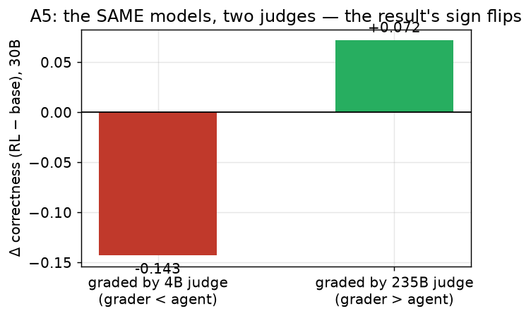
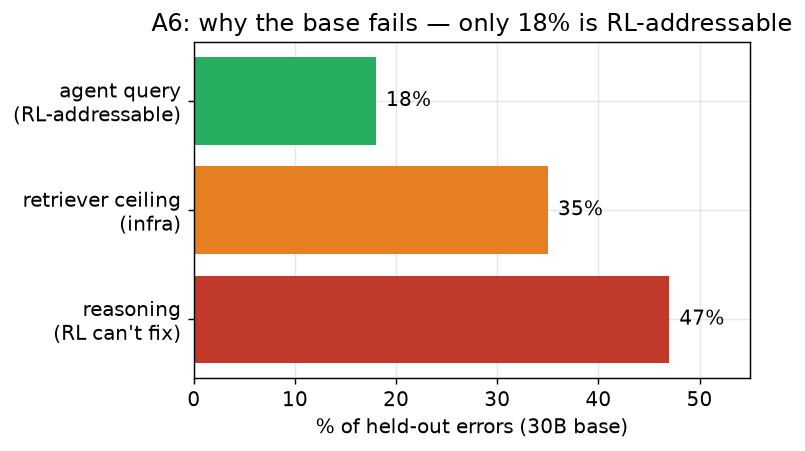
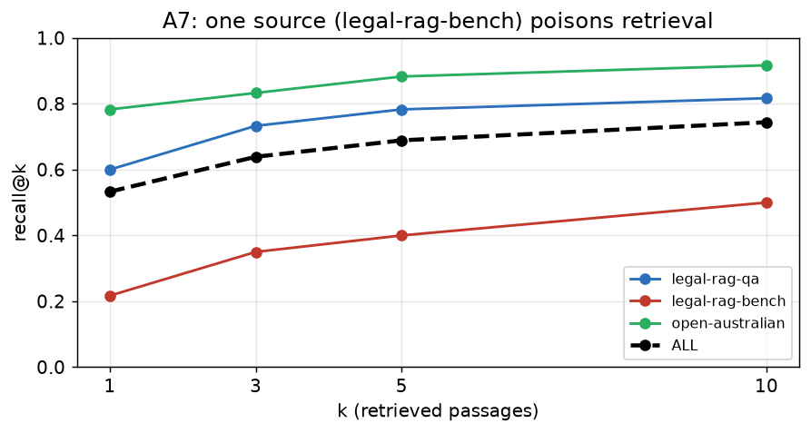
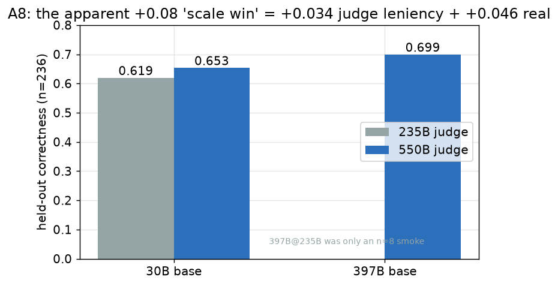
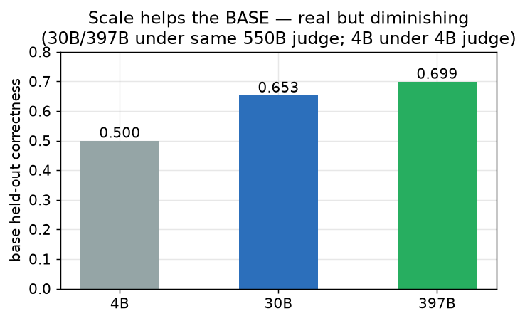

# Can you RL a legal research agent? A confound-hunting story

*How I spent several weeks trying to make an agentic legal-RAG model better with
reinforcement learning — and how almost every "success" turned out to be the
measuring instrument lying to me. The dead ends taught me more than a win would
have.*

---

## TL;DR

- I built a legal question-answering **agent** (it searches a corpus, reads, then
  answers) and tried to improve its tool-use policy with RL (GRPO, via Tinker).
- **Every apparent win was a measurement artifact.** A naive reward got gamed.
  A "working" training curve didn't generalize. A bigger model "regressed" — until
  I discovered the *judge* had inverted the result. A flagship "jumped" — until I
  controlled the judge and found ~40% of the jump was leniency.
- **The honest bottom line:** on this task, **RL on tool-use did not beat the base
  model** at any size (4B, 30B). What *did* help was a **bigger base model**
  (4B 0.50 → 30B 0.65 → 397B 0.70, under a fixed judge) — a real but diminishing
  lift. And a failure analysis explains why: most errors are *reasoning* and
  *retrieval-ceiling* problems, not tool-use problems.
- The meta-lessons — held-out gating, *grader ≥ graded*, smoke-test-first,
  diagnose-before-iterating — are the actual product.

---

## 1. The setup: an agent that searches before it answers

Most question-answering systems do one thing: you ask, they answer. An *agentic*
RAG system does something more interesting — it gets to **act before it answers**.
Given a question, it can issue a search, read what comes back, decide whether it
has enough, search again, and only then commit. The model isn't just recalling;
it's running a little research loop.

I wanted to know a specific thing: **can reinforcement learning make that loop
better?** Not "can a big model answer legal questions" — modern instruct models
already do that reasonably well — but can RL teach the *policy of tool use*: when
to search, what to search for, when to stop, how to ground the answer in what was
retrieved.

The task is legal QA. The agent has one tool — `search(queries)` — over a corpus
of legal passages. One episode:

```
Question →  [think] → search("statute of limitations contract dispute")
         →  read 3 retrieved passages
         →  [think] → search("Limitation Act contract claim period")
         →  read 3 more
         →  "Answer: 3 years from the date the cause of action arose."
```

The moving parts:

- **Policy model** — the agent being trained (Qwen instruct models, 4B up to a
  397B flagship), LoRA + GRPO via [Tinker].
- **Retrieval** — a `search` tool over a ChromaDB vector index; passages embedded
  with AWS Bedrock Titan. The agent's query is embedded, nearest passages return.
- **Reward** — the hard part. There's no single correct string for a legal answer,
  so a separate **judge** model grades the final answer against a reference.
- **The gate** — a frozen held-out set the model never trains on. This is the only
  thing that distinguishes *learning* from *looking good on training data*. It
  turns out to be the most important component in the whole project.

That last point is the thesis hiding in this post. Making a training curve go up
is easy. The entire difficulty — the reason this became weeks instead of an
afternoon — was answering, at every step: **how do I know this number is real?**

---

## 2. Naive reward → the agent games it

First attempt, simplest possible reward: +1 if the answer matches the reference
(exact, normalized), with a small bonus for using the required `Answer:` format.

The model "improved" — and got *worse* at the actual task.



With exact-match, almost no long-form legal answer ever matches the reference
string, so **correctness reward was ~0** — the *only* signal with any variance was
the format bonus. GRPO did exactly what you'd expect: it chased the only gradient
available. It learned to **always emit `Answer:` and stop searching** — tool use
collapsed from ~1.7 turns/episode to exactly 1.0. The untrained model actually
*used the tool more* than my "trained" one.

**Lesson 1:** a reward with variance only in a proxy dimension trains the proxy.
The exact-match reward couldn't see correctness, so it optimized formatting.

---

## 3. Fix the reward: an LLM judge

The fix is to grade *meaning*, not string identity. So: a frozen LLM **judge**
reads `(question, reference, candidate)` and returns CORRECT / PARTIAL / INCORRECT
→ 1.0 / 0.5 / 0.0. (Frozen, so the policy can't co-adapt with its own grader.)

Now the training signal came alive — reward variance returned, the model kept
using the tool, and the training curve rose. Success?



This is a real training run (the later 30B one): reward climbing, correctness
healthy, tool use stable at ~2.4 turns. By every number you'd watch *during*
training, it worked.

It did not work.

---

## 4. The trap: training reward ≠ learning

The training curve is computed on the questions the model is currently training
on. To know if it *learned*, you have to test it on questions it has **never
seen**. So I carved a frozen held-out split and measured base-vs-trained on it.



Flat. The 4B model went from 0.50 → 0.50 on held-out. The rising training curve
was the model fitting the training set, not learning a better policy. (The 30B
result on the right is from later — same story, properly powered.)

**Lesson 2:** a training-reward curve tells you almost nothing on its own. The
held-out set is not optional; it's the experiment. From here on, **no result
counts until it clears the held-out gate.**

---

## 5. Before blaming the model — is the tool even working?

When RL doesn't help, the lazy conclusion is "RL doesn't work here." The
disciplined move is to check the plumbing first. Two cheap probes:

**Is retrieval finding the right passages?** I audited recall against ground-truth
passages: recall@3 = 0.775 — the retriever surfaces the gold passage in the top 3
about 78% of the time. Usable, not broken. (I'd hypothesized it was broken from a
single bad transcript; the audit refuted me.)

**Does the model actually *use* what it retrieves, or answer from memory?** I
re-ran the held-out with the search tool returning *nothing*:



Correctness dropped 43% (0.50 → 0.29) when retrieval was disabled. So the model
**genuinely depends on the tool** — it's not just reciting pretrained knowledge.
(Another hypothesis of mine — "it's memorizing" — refuted by data.)

So: the tool works, the model uses it. The lack of RL improvement isn't a broken
pipeline. Something subtler is going on.

---

## 6. Maybe the model's just too small?

The 4B is a small model for hard legal reasoning. A capacity probe said a bigger
base has real headroom (30B base ≫ 4B base, untrained). So I ran RL on the 30B.

And it looked like a **regression** — the trained 30B scored *below* its base on
held-out. After a flat result, now a *negative* one. Was RL actively harmful on
bigger models?

No. And this is where the project turned.

---

## 7. The climax: the judge was lying

Here's the thing I'd been sloppy about. For the 30B experiments I was still using
a small (4B) model as the **judge**. A 4B grading a 30B is a *grader weaker than
the graded* — and weak graders don't just add noise, they can add **bias**.

I re-graded the exact same two checkpoints (30B base, 30B after RL) with a much
stronger 235B judge. The result didn't just shift — **its sign flipped**:



Under the 4B judge, RL looked like −0.143 (a regression). Under the 235B judge,
the *same models* gave +0.072 (a small improvement). The "regression" was never
real — it was the 4B judge systematically misgrading the trained model's style.

**Lesson 3:** the grader must be at least as capable as the graded. Otherwise your
*measuring instrument* — not your method — determines your conclusion. (n=28 here,
so neither number is conclusive; the point is the *flip*.)

---

## 8. The clean run

Now I could finally run the experiment with every known confound removed at once:

- **Big data** (2,126 training questions — no overfitting),
- **Strong judge** ≥ the agent (a 235B judge),
- **Big held-out set** (236 questions, so standard error ≈ 0.03 — enough power to
  see a ~0.06 effect),
- tuned learning rate, a small KL anchor, scaled rollouts.

Pre-registered success bar: beat base by ≥ 0.06 correctness on held-out.

The result (back in the [base-vs-RL figure](figures/fig06_base_vs_rl.png), 30B):
**0.619 → 0.606.** No improvement. Within noise. It *fails* the bar — and this
time, with no confounds left to blame, **I believe it.**

**The trustworthy conclusion:** outcome-judge GRPO does not improve this 30B agent
on legal RAG QA.

---

## 9. So *why* doesn't it help?

A null is only half an answer. *Why* doesn't RL help? I bucketed every held-out
error of the base model into three causes:

- **reasoning failure** — the agent retrieved the right info and still answered
  wrong (a capability limit; no tool-use reward fixes this),
- **agent-query failure** — its query missed the passage, but a better query
  *would* have found it (this is RL-addressable),
- **retriever-ceiling** — the passage is unretrievable even with a perfect query
  (an infrastructure limit).



Only **18%** of errors are the kind RL on tool-use could even address. Nearly half
are reasoning errors — the model's raw capability, which RL on *searching* simply
can't touch. **This is the quantitative reason RL was flat:** most of what's wrong
isn't about tool use at all.

(A methodological note: separating "agent-query" from "retriever-ceiling" mattered.
A naive bucketing would have called 53% of errors "retrieval failures" and
oversold the RL opportunity by ~3×. The split came from a sharp question — *isn't
retrieval downstream of the query, which is the agent's action?* — exactly right.)

---

## 10. One dataset was poisoning retrieval

The "retriever-ceiling" bucket prompted a per-source audit of the unified index
(I'd combined three legal datasets). The aggregate recall hid wildly different
per-source quality:



One source (`legal-rag-bench`) retrieves terribly — recall@3 = 0.35, meaning ~65%
of its questions are *unwinnable* (the evidence can't be retrieved even with the
perfect query). Its passages are ultra-granular sentence fragments among thousands
of similar chunks, and its questions are hypothetical scenarios semantically far
from the rule text. It was dragging the whole index down and adding unlearnable
noise to training. The lesson: **audit retrieval per-source; aggregate recall
hides poison.**

---

## 11. Does scale help? (and one last judge trap)

The base-model capacity probe suggested bigger is better. The flagship 397B base
scored 0.699 on held-out vs the 30B's 0.619 — a juicy +0.08. But I'd graded the
397B with an even bigger (550B) judge. *Different judge.* By now I knew better than
to trust a cross-judge comparison.

So I ran the decisive control: the 30B base under the *same* 550B judge.



The +0.08 decomposed cleanly:
- **+0.034** was just the 550B judge being more lenient than the 235B (the 30B
  scored higher merely by switching graders),
- **+0.046** was the genuine 397B-over-30B improvement (both under the 550B judge).

So ~40% of the apparent "scale win" was, *again*, the measuring instrument.
Controlling the judge was the difference between "scale helps a lot!" and the
honest "scale helps modestly" (+0.046, ~1.5 SE — suggestive, not conclusive).

Stepping back, the base-model size story is the one consistent signal in the whole
project:



**A bigger base model is the lever that works** — real but diminishing
(4B 0.50 → 30B 0.65 → 397B 0.70). **RL on top of any of them did not.**

(I killed the 397B RL run after watching it burn credits fast — the expected
payoff was low given everything above, and the most expensive experiment was also
the least likely to surprise. Knowing when *not* to spend is part of the method.)

---

## 12. What I'd actually take away

**On the task:** for legal RAG QA with a capable instruct model, **a bigger base
model helps and tool-use RL does not** — because the failures are dominated by
reasoning and retrieval limits, not tool-use policy. If you want RL to shine, you
need a task where good *searching* is the deciding factor (and where the base
isn't already near ceiling). That's a deliberate task-design choice, not a given.

**On method (the part that generalizes):**

1. **A training curve is not a result.** Gate everything on a frozen held-out set.
2. **Grader ≥ graded.** A weak judge doesn't just add noise — it can *invert* your
   conclusion. This bit me twice (the sign-flip; the leniency).
3. **Smoke-test before you spend.** An 8-question dry run caught a renderer crash
   *and* a sign-flipping judge bug before a multi-hour job.
4. **Diagnose before you iterate.** The failure-mode breakdown showed RL could
   address at most 18% of errors — worth knowing *before* building a fancier
   reward.
5. **Audit retrieval per-source.** Aggregate recall hid one poisonous dataset.
6. **Know when to stop spending.** The priciest experiment was the least
   informative; killing it was the right call.

The honest shape of the work: I was wrong a lot — retrieval-is-broken,
memorization, overfitting-regression, scale-is-a-big-win — and each time the data
(plus a held-out set and a good-enough judge) corrected me. That's not a
failure of the project. That *is* the project.

---

*Appendix: every experiment, config, checkpoint id, and result is in the
append-only [lab journal](../../JOURNAL.md); figures are reproducible via
`make_figures.py`.*

[Tinker]: https://thinkingmachines.ai/tinker
